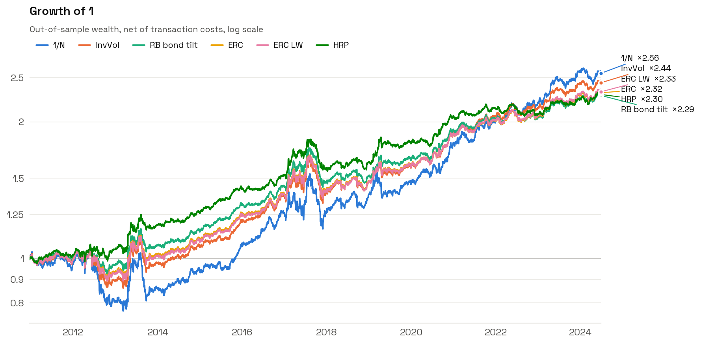

# portopt

Toolkit de recherche en allocation de portefeuille : données, estimateurs risk-based, backtest walk-forward, métriques de performance et de risque, graphiques.



**Documentation complète : [`docs/METHODOLOGY.md`](docs/METHODOLOGY.md)**, également en PDF LaTeX : [`docs/methodology.pdf`](docs/methodology.pdf) (FR) et [`docs/methodology_en.pdf`](docs/methodology_en.pdf) (EN) (source `docs/methodology.tex`, compilation `cd docs && latexmk -xelatex methodology.tex`). Théorie, démonstrations, exemples chiffrés et tips de praticien pour chaque méthode d'allocation et chaque indicateur.

## Structure

```
portopt/
├── data.py         # yfinance -> prix nettoyés -> rendements ; simulateur multi-actifs réaliste
├── estimator.py    # 1/N, InverseVolatility, RiskParity (budgets), ERC, HRP ; covariances sample / Ledoit-Wolf / EWMA
├── backtester.py   # Backtester(returns, estimator, in_sample, out_of_sample) -> rendements OOS nets de coûts
├── metric.py       # CAGR, vol, Sharpe, Sortino, Calmar, drawdowns, VaR/CVaR, PSR, summary()
├── plot.py         # graphiques fond blanc, palette validée daltonisme, rapport PNG complet
└── fonts/          # Space Grotesk / Space Mono (OFL)
docs/
├── METHODOLOGY.md  # le guide
├── methodology.tex # le guide en LaTeX (-> methodology.pdf)
├── methodology_en.tex # version anglaise (-> methodology_en.pdf)
├── make_figures.py # régénère toutes les figures du guide
└── figures/
examples/run_backtest.py
tests/              # propriétés théoriques, no look-ahead, maths du backtest, métriques
```

## Installation

```bash
pip install -e ".[dev]"     # numpy, pandas, scipy, yfinance + pytest, matplotlib
pytest
```

## Usage

```python
from portopt import load_returns, ERC, HRP, EqualWeight, Backtester, run_backtests, summary
from portopt import plot

R = load_returns(["SPY", "TLT", "GLD", "DBC", "EFA"], start="2008-01-01", cache_dir="data_cache")

# une stratégie
bt = Backtester(R, ERC(cov_method="ledoit_wolf"), in_sample=252, out_of_sample=21,
                transaction_cost_bps=5)
oos = bt.run()              # pd.Series des rendements OOS nets de coûts
bt.weights_                 # poids cibles à chaque rebalancement
bt.turnover_                # turnover one-way à chaque rebalancement
bt.risk_contributions()     # contributions au risque ex ante à chaque rebalancement

# plusieurs stratégies
rets, bts = run_backtests(R, {"1/N": EqualWeight(), "ERC": ERC(), "HRP": HRP()}, 252, 21,
                          transaction_cost_bps=5)
summary(rets, turnover={k: b.annualized_turnover() for k, b in bts.items()})

# rapport graphique (13 PNG)
plot.save_report(rets, bts, "outputs/charts")
```

Exemple complet sur 10 ETF multi-actifs :

```bash
python examples/run_backtest.py              # données Yahoo Finance depuis 2008
python examples/run_backtest.py --synthetic  # hors ligne, données simulées
```

## Méthodes

| Estimateur | Principe | Paramètres |
|---|---|---|
| `EqualWeight` | $w_i = 1/N$ | |
| `InverseVolatility` | $w_i \propto \sigma_i^{-k}$ | `exponent` |
| `RiskParity` | $w_i(\Sigma w)_i / w^\top\Sigma w = b_i$, résolu par descente par coordonnées sur le problème convexe de Spinu | `budgets`, `tol`, `max_iter` |
| `ERC` | `RiskParity` avec $b_i = 1/N$ | |
| `HRP` | clustering hiérarchique + bissection récursive (López de Prado 2016) | `linkage`, `split="bisection" \| "dendrogram"` |

Tous acceptent `cov_method="sample" | "ledoit_wolf" | "ewma"` ou un callable `returns -> ndarray`.

Ajouter une méthode : hériter de `BaseEstimator` et implémenter `_compute_weights(returns) -> np.ndarray`.

## Graphiques

`portopt.plot` : fond blanc, typographie Space Grotesk embarquée, palette catégorielle validée pour la séparation daltonienne, une couleur fixe par stratégie dans tous les graphiques, titres et légendes hors de la zone de données, labels directs en fin de courbe.

| Fonction | Graphique |
|---|---|
| `plot_wealth` | croissance de 1, échelle log, labels de fin de courbe |
| `plot_drawdowns` | small multiples, MaxDD annoté |
| `plot_rolling(stat="vol" \| "sharpe")` | volatilité ou Sharpe glissants |
| `plot_metrics` | barres par métrique |
| `plot_heatmap` | tableau annoté (poids, contributions au risque, corrélations) |
| `plot_weights_through_time` | heatmap actifs × dates |
| `plot_correlation` | matrice de corrélation, ordre libre (ex. `HRP.order_`) |
| `save_report` | tout ce qui précède en PNG |

Note : Yahoo Finance n'est pas testé en réseau ici (le téléchargement est testé avec un mock) ; les figures de la doc sont sur données simulées.
