# Méthodologie : allocation de portefeuille et mesure de performance

Guide de référence de `portopt`. Chaque méthode est présentée de la même façon : **l'intuition**, **la théorie** (avec démonstrations), **un exemple chiffré**, **les tips de praticien**, et **où c'est dans le code**.

Les figures sont générées par `python docs/make_figures.py` (données simulées par `portopt.data.simulate_returns`, univers de 10 ETF multi-actifs, 15 ans).

---

## Sommaire

1. [Données et rendements](#1-données-et-rendements)
2. [Estimer la covariance](#2-estimer-la-covariance)
3. [La brique commune : contributions au risque](#3-la-brique-commune--contributions-au-risque)
4. [Méthodes d'allocation](#4-méthodes-dallocation)
   - [4.1 Equal Weight (1/N)](#41-equal-weight-1n)
   - [4.2 Inverse Volatility](#42-inverse-volatility)
   - [4.3 Risk Budgeting (Risk Parity)](#43-risk-budgeting-risk-parity)
   - [4.4 Equal Risk Contribution (ERC)](#44-equal-risk-contribution-erc)
   - [4.5 Hierarchical Risk Parity (HRP)](#45-hierarchical-risk-parity-hrp)
   - [4.6 Tableau comparatif](#46-tableau-comparatif)
5. [Le backtest walk-forward](#5-le-backtest-walk-forward)
6. [Indicateurs de performance](#6-indicateurs-de-performance)
7. [Indicateurs de risque](#7-indicateurs-de-risque)
8. [Significativité statistique](#8-significativité-statistique)
9. [Lecture des résultats de l'exemple](#9-lecture-des-résultats-de-lexemple)
10. [Checklist de l'expert](#10-checklist-de-lexpert)
11. [Références](#11-références)

**Notations.** $N$ actifs, $T$ observations, $R_t \in \mathbb{R}^N$ le vecteur des rendements simples en $t$, $w \in \mathbb{R}^N$ les poids ($\mathbf{1}^\top w = 1$, $w \ge 0$), $\Sigma$ la matrice de covariance, $\sigma_i = \sqrt{\Sigma_{ii}}$, $\rho_{ij}$ les corrélations, $P$ le nombre de périodes par an (252 en daily).

---

## 1. Données et rendements

### Rendement simple et log

$$R_t = \frac{P_t}{P_{t-1}} - 1, \qquad r_t = \ln\frac{P_t}{P_{t-1}} = \ln(1 + R_t)$$

Leur propriété d'agrégation est opposée :

| | Agrégation en **coupe** (entre actifs) | Agrégation dans le **temps** |
|---|---|---|
| Simple $R$ | $R_{p,t} = \sum_i w_i R_{i,t}$ **exact** | $\prod_t (1+R_t) - 1$ |
| Log $r$ | faux : $r_p \neq \sum_i w_i r_i$ | $\sum_t r_t$ **exact** |

*Démonstration.* La richesse du portefeuille est $V_t = \sum_i n_i P_{i,t}$ donc $V_t / V_{t-1} = \sum_i \frac{n_i P_{i,t-1}}{V_{t-1}} \frac{P_{i,t}}{P_{i,t-1}} = \sum_i w_i (1 + R_{i,t})$, d'où $R_{p,t} = w^\top R_t$. Pour le log, $\ln \sum_i w_i e^{r_i} \neq \sum_i w_i r_i$ par stricte concavité du log (Jensen). $\blacksquare$

**Conséquence** : toute construction de portefeuille et tout backtest se font en rendements **simples**. Les log-rendements servent à la modélisation statistique (plus symétriques, additifs dans le temps).

Relation utile (développement de Taylor) : $r \approx R - R^2/2$. L'écart est négligeable en daily, pas en annuel.

### Alignement temporel

Dans `portopt`, $R_t$ daté $t$ est le rendement de la clôture $t-1$ à la clôture $t$. Un poids décidé avec l'information disponible à la clôture $t-1$ gagne $R_t$. C'est cet alignement qui garantit l'absence de look-ahead dans le backtest.

### Nettoyage

`clean_prices` applique trois règles :

1. **Forward-fill limité** (`ffill_limit=5`) : comble les jours fériés quand on mélange des places (Londres fermé, New York ouvert). Au-delà, un trou est une vraie absence de donnée.
2. **Jamais de back-fill** : `bfill` recopie un prix futur dans le passé, c'est du look-ahead déguisé.
3. **Les NaN initiaux sont gardés** : un ETF lancé en 2012 a des NaN avant. Le backtester ne l'investit qu'une fois qu'il a une fenêtre in-sample complète. Supprimer en amont les actifs "incomplets" ne garderait que les survivants : **biais de survie**.

### Prix ajustés

`download_prices(auto_adjust=True)` renvoie des clôtures ajustées des splits et dividendes, donc des rendements **total return**. Sur des prix bruts, chaque détachement de dividende apparaît comme une perte (un ETF obligataire perdrait artificiellement 3 à 4 % par an).

> **Dans le code** : `portopt/data.py`, fonctions `download_prices`, `clean_prices`, `compute_returns`, `resample_returns`, `load_returns`, `simulate_returns`.

---

## 2. Estimer la covariance

Toutes les méthodes sauf 1/N consomment $\Sigma$. La qualité de l'allocation est bornée par la qualité de cet estimateur.

### 2.1 Covariance empirique

$$S = \frac{1}{T-1} \sum_{t=1}^{T} (R_t - \bar R)(R_t - \bar R)^\top$$

Sans biais, mais **bruitée** quand $N/T$ n'est pas petit. $S$ a $N(N+1)/2$ paramètres : 55 pour 10 actifs, 5 050 pour 100 actifs. Avec $T = 252$, estimer 5 050 paramètres avec 25 200 nombres n'a pas de sens.

**Le problème du spectre** (Marchenko-Pastur). Même si la vraie matrice est l'identité, les valeurs propres de $S$ s'étalent sur

$$\lambda \in \left[(1 - \sqrt{q})^2,\ (1 + \sqrt{q})^2\right], \qquad q = N/T$$

Avec $q = 0.5$ : valeurs propres entre 0.09 et 2.91 au lieu de 1. Les **grandes valeurs propres sont surestimées, les petites sous-estimées**. Or toute méthode qui inverse $\Sigma$ (min-variance, Markowitz) donne le plus de poids aux directions de plus petite variance, c'est-à-dire exactement celles où l'estimation est la plus fausse. C'est l'"error maximization" de Michaud (1989).

Si $T < N$, $S$ est singulière (rang $T - 1$) : non inversible.

### 2.2 Ledoit-Wolf (2004)

Idée : faire une moyenne pondérée entre $S$ (sans biais, forte variance) et une cible structurée $F$ (biaisée, variance nulle). Le compromis biais-variance optimal a une forme fermée.

$$\hat\Sigma = \delta\, \mu I + (1 - \delta)\, S, \qquad \mu = \frac{\operatorname{tr}(S)}{N}$$

Avec la norme de Frobenius normalisée $\lVert A \rVert^2 = \operatorname{tr}(AA^\top)/N$ :

$$d^2 = \lVert S - \mu I \rVert^2, \qquad \bar b^2 = \frac{1}{T^2} \sum_{t=1}^{T} \lVert x_t x_t^\top - S \rVert^2, \qquad \delta^{\ast} = \frac{\min(\bar b^2, d^2)}{d^2}$$

**Interprétation** :
- $d^2$ : à quel point $S$ est éloignée de la cible (dispersion de ses valeurs propres).
- $\bar b^2$ : à quel point $S$ est incertaine (variance d'échantillonnage estimée à partir des observations elles-mêmes).
- $\delta^{\ast}$ : fraction de la dispersion observée qui est du bruit. Plus $T$ est petit relativement à $N$, plus $\bar b^2$ est grand, plus on shrink.

**Propriétés** : $\hat\Sigma$ est toujours définie positive (si $\delta > 0$), les valeurs propres sont contractées vers $\mu$ **sans changer les vecteurs propres**, le conditionnement s'améliore.

**Astuce de calcul** (implémentée) : pas besoin de former les $T$ matrices $x_t x_t^\top$. En développant la norme,

$$\sum_t \lVert x_t x_t^\top - S \rVert_F^2 = \sum_t (x_t^\top x_t)^2 - T \lVert S \rVert_F^2$$

car $\sum_t x_t^\top S x_t = \operatorname{tr}(X S X^\top) = T \operatorname{tr}(S^2)$. Coût $O(TN + N^2)$ au lieu de $O(TN^2)$.

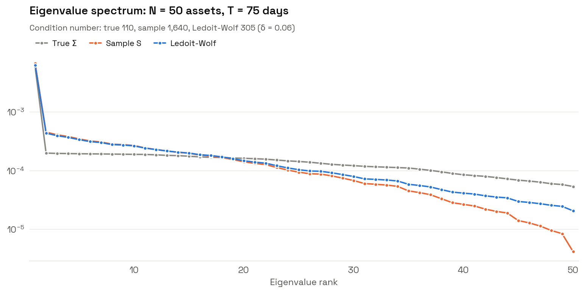

Ici 50 actifs, 75 jours, vrai modèle à un facteur. La covariance empirique écrase les petites valeurs propres (la dernière est 10 fois trop petite) et gonfle le conditionnement. Ledoit-Wolf les remonte et divise le conditionnement par 5.

### 2.3 EWMA (RiskMetrics)

$$\hat\Sigma_t = \sum_{s=0}^{T-1} \omega_s (R_{t-s} - \bar R)(R_{t-s} - \bar R)^\top, \qquad \omega_s \propto \lambda^s, \quad \lambda = 2^{-1/h}$$

avec $h$ la demi-vie (63 jours par défaut). Réagit plus vite aux changements de régime. Le nombre effectif d'observations est $\approx (1+\lambda)/(1-\lambda)$, soit environ 180 jours pour $h = 63$ : plus réactif, mais plus bruité.

### Tips

- Le choix de l'estimateur de covariance compte souvent **plus** que le choix entre ERC et HRP.
- La moyenne $\mu$ est bien plus difficile à estimer que $\Sigma$. L'erreur standard d'une moyenne annualisée est $\sigma/\sqrt{\text{années}}$ : avec $\sigma = 16\%$ et 10 ans, $\pm 5\%$ de précision sur une moyenne de 8 %. Elle ne dépend **pas** de la fréquence d'échantillonnage. Celle d'une variance décroît avec le **nombre d'observations** : passer en daily aide. C'est la raison de fond pour laquelle toutes les méthodes de ce repo ignorent $\mu$.
- Au-delà de 50 actifs, préférer un modèle factoriel ($\Sigma = B \Sigma_F B^\top + D$) ou le shrinkage non linéaire (Ledoit-Wolf 2017/2020).

> **Dans le code** : `portopt/estimator.py`, `sample_cov`, `ledoit_wolf_cov`, `ewma_cov`, `estimate_cov`. Chaque estimateur prend `cov_method="sample" | "ledoit_wolf" | "ewma"` ou un callable `returns -> ndarray`.

---

## 3. La brique commune : contributions au risque

### Décomposition d'Euler

La volatilité du portefeuille $\sigma_p(w) = \sqrt{w^\top \Sigma w}$ est **homogène de degré 1** : $\sigma_p(\lambda w) = \lambda \sigma_p(w)$. Le théorème d'Euler pour les fonctions homogènes donne alors

$$\sigma_p = \sum_{i=1}^{N} w_i \frac{\partial \sigma_p}{\partial w_i}$$

*Démonstration.* Dériver $\sigma_p(\lambda w) = \lambda \sigma_p(w)$ par rapport à $\lambda$ et évaluer en $\lambda = 1$ : $\sum_i w_i \partial_i \sigma_p(w) = \sigma_p(w)$. $\blacksquare$

Avec $\frac{\partial \sigma_p}{\partial w} = \frac{\Sigma w}{\sigma_p}$ :

$$\underbrace{MRC_i = \frac{(\Sigma w)_i}{\sigma_p}}_{\text{contribution marginale}}, \qquad \underbrace{RC_i = w_i \frac{(\Sigma w)_i}{\sigma_p}}_{\text{contribution totale}}, \qquad \sum_i RC_i = \sigma_p$$

La **contribution relative** $RC_i / \sigma_p = w_i (\Sigma w)_i / (w^\top \Sigma w)$ somme à 1 : c'est la part du risque total imputable à l'actif $i$.

### Interprétation de $MRC_i$

$(\Sigma w)_i = \operatorname{Cov}(R_i, R_p)$, donc

$$MRC_i = \frac{\operatorname{Cov}(R_i, R_p)}{\sigma_p} = \rho_{i,p}\, \sigma_i = \beta_{i,p}\, \sigma_p$$

Un actif contribue au risque en proportion de son **bêta au portefeuille**, pas de sa volatilité propre. Un actif très volatil mais décorrélé du portefeuille contribue peu. Un actif avec $\rho_{i,p} < 0$ a une contribution **négative** : il réduit le risque.

### Exemple chiffré

60/40 actions/obligations, $\sigma_A = 16\%$, $\sigma_O = 6\%$, $\rho = -0.2$ :

- $\sigma_p^2 = 0.6^2 \cdot 0.16^2 + 0.4^2 \cdot 0.06^2 + 2 \cdot 0.6 \cdot 0.4 \cdot (-0.2) \cdot 0.16 \cdot 0.06 = 0.009216 + 0.000576 - 0.000922 = 0.008870$, soit $\sigma_p = 9.4\%$
- $(\Sigma w)_A = 0.6 \cdot 0.0256 + 0.4 \cdot (-0.00192) = 0.014592$, donc $RC_A / \sigma_p = 0.6 \cdot 0.014592 / 0.008870 = 98.7\%$
- $RC_O / \sigma_p = 1.3\%$

**Un portefeuille "60/40" est un portefeuille "99/1" en risque.** C'est la motivation historique du risk parity.

> **Dans le code** : `portopt.estimator.risk_contributions(w, cov)` et `Backtester.risk_contributions()` (contributions ex ante à chaque rebalancement).

---

## 4. Méthodes d'allocation

Interface commune :

```python
est = ERC(cov_method="ledoit_wolf").fit(returns_in_sample)   # DataFrame T x N, sans NaN
est.weights_    # pd.Series, somme 1, long-only
est.cov_        # covariance utilisée
```

### 4.1 Equal Weight (1/N)

$$w_i = \frac{1}{N}$$

**Intuition.** Ne rien estimer, donc ne rien estimer de faux.

**Théorie.** Si les $N$ actifs ont la même volatilité $\sigma$ et la même corrélation $\rho$, $\sigma_p^2 = \frac{\sigma^2}{N}(1 + (N-1)\rho) \to \rho\sigma^2$ : la diversification élimine le risque idiosyncratique mais pas le risque commun.

**Résultat clé** (DeMiguel, Garlappi & Uppal 2009). Sur 7 jeux de données empiriques, **aucune** des 14 méthodes d'optimisation testées (Markowitz, Bayes-Stein, min-variance contrainte, etc.) ne bat significativement 1/N en Sharpe out-of-sample. La fenêtre d'estimation nécessaire pour que Markowitz batte 1/N est de l'ordre de **3 000 mois pour 25 actifs**. 1/N est le **benchmark minimal** de toute recherche en allocation.

**Limites.**
- Allocation en capital, pas en risque : l'actif le plus volatil domine (§3).
- Dépend de la définition de l'univers : ajouter 5 ETF actions à un univers de 10 change radicalement le portefeuille.

**Tip.** Le turnover de 1/N n'est pas nul : les poids dérivent avec les prix et il faut rebalancer (38 %/an dans l'exemple). Un 1/N "buy and hold" n'est plus un 1/N après 6 mois.

> **Dans le code** : `EqualWeight()`.

### 4.2 Inverse Volatility

$$w_i = \frac{\sigma_i^{-k}}{\sum_j \sigma_j^{-k}}, \qquad k = 1 \text{ (inverse vol)},\ k = 2 \text{ (inverse variance)}$$

**Intuition.** Donner à chaque actif le même "budget de vol" en ignorant les corrélations : $w_i \sigma_i = \text{constante}$. On l'appelle aussi **naive risk parity**.

**Deux résultats exacts.**

1. *Si toutes les corrélations sont égales, InvVol = ERC.* Avec $\rho_{ij} = \rho$ et $w_i = c/\sigma_i$ :
   $$(\Sigma w)_i = \sigma_i \sum_j \rho_{ij} \sigma_j w_j = \sigma_i\, c\, (1 + (N-1)\rho)$$
   donc $RC_i \propto w_i (\Sigma w)_i = c^2 (1 + (N-1)\rho)$, identique pour tout $i$. $\blacksquare$
2. *Si $\Sigma$ est diagonale, inverse variance = min-variance.* Le min-variance est $w \propto \Sigma^{-1}\mathbf{1}$, et $\Sigma^{-1}\mathbf{1} = (1/\sigma_i^2)_i$. $\blacksquare$

Donc InvVol est ERC sous l'hypothèse "corrélations homogènes", et inverse variance est min-variance sous l'hypothèse "corrélations nulles". La différence entre InvVol et ERC mesure **l'information apportée par la structure de corrélation**.

**Tip.** Avec deux actifs, InvVol = ERC **quelle que soit** $\rho$ (il n'y a qu'une corrélation, elle est donc homogène).

> **Dans le code** : `InverseVolatility(exponent=1)`.

### 4.3 Risk Budgeting (Risk Parity)

**Problème.** Étant donné des budgets $b_i > 0$, $\sum b_i = 1$, trouver $w \ge 0$ tel que

$$\frac{RC_i}{\sigma_p} = \frac{w_i (\Sigma w)_i}{w^\top \Sigma w} = b_i \quad \forall i$$

C'est un système non linéaire. L'astuce est de le transformer en **problème convexe**.

**Théorème** (Spinu 2013, Roncalli 2013). Soit

$$y^{\ast} = \arg\min_{y > 0}\ f(y) = \tfrac12\, y^\top \Sigma y - \sum_{i=1}^N b_i \ln y_i$$

Alors $w^{\ast} = y^{\ast} / \mathbf{1}^\top y^{\ast}$ est l'unique portefeuille long-only de risk budgeting.

*Démonstration.*
- **Existence.** $f \to +\infty$ quand un $y_i \to 0^+$ (barrière log) et quand $\lVert y \rVert \to \infty$ (le terme quadratique domine le log, $\Sigma \succ 0$). $f$ est continue, donc atteint son minimum à l'intérieur de $\mathbb{R}^N_{++}$.
- **Unicité.** $\nabla^2 f = \Sigma + \operatorname{diag}(b_i / y_i^2) \succ 0$ : $f$ est strictement convexe.
- **Condition du premier ordre.** $\nabla f = 0 \iff (\Sigma y)_i = b_i / y_i \iff y_i (\Sigma y)_i = b_i$. Les contributions au risque (non normalisées) de $y$ sont exactement les $b_i$.
- **Invariance d'échelle.** $RC_i(\lambda y) = \lambda^2 y_i (\Sigma y)_i$ : les contributions **relatives** ne changent pas en normalisant $w = y / \mathbf{1}^\top y$.
- **Bonus.** En sommant la CPO : $y^{*\top} \Sigma y^{\ast} = \sum_i b_i = 1$. $\blacksquare$

**Algorithme : descente par coordonnées cyclique** (Griveau-Billion, Richard & Roncalli 2013). On minimise $f$ en $y_i$ seul, les autres fixés. La CPO en $y_i$ est

$$\Sigma_{ii}\, y_i^2 + c_i\, y_i - b_i = 0, \qquad c_i = \sum_{j \neq i} \Sigma_{ij}\, y_j$$

Trinôme de discriminant $c_i^2 + 4\Sigma_{ii} b_i > 0$, produit des racines $-b_i / \Sigma_{ii} < 0$ : **une seule racine positive**,

$$y_i \leftarrow \frac{-c_i + \sqrt{c_i^2 + 4\, \Sigma_{ii}\, b_i}}{2\, \Sigma_{ii}}$$

On boucle sur $i = 1, \dots, N$ jusqu'à convergence. La descente par coordonnées converge vers l'optimum global pour une fonction strictement convexe et lisse (Tseng 2001).

**Détails d'implémentation** :
- Le vecteur $\Sigma y$ est mis à jour **incrémentalement** : quand $y_i$ change de $\Delta$, $\Sigma y \mathrel{+}= \Delta \cdot \Sigma_{:,i}$. Coût $O(N)$ par coordonnée, $O(N^2)$ par cycle, **aucune inversion de matrice**.
- Initialisation : $y^{(0)} \propto b_i / \sigma_i$, remis à l'échelle $y^\top \Sigma y = 1$ (on démarre près de la solution).
- Critère d'arrêt : $\lVert y^{(k)} - y^{(k-1)} \rVert \le 10^{-10} \lVert y^{(k)} \rVert$. En pratique 10 à 50 cycles.

**Usage des budgets.** Exprimer une vue **en risque** plutôt qu'en capital. Dans l'exemple, `RB bond tilt` donne un budget double à TLT, IEF, LQD : les trois portent 45 % du risque total (15 % chacun) contre 30 % en ERC.

**Tips.**
- Les budgets doivent être **strictement** positifs (barrière log). Pour exclure un actif, retirez-le de l'univers.
- Sans contrainte long-only, le système de risk budgeting peut avoir jusqu'à $2^{N-1}$ solutions (une par configuration de signes, au signe global près) : la solution long-only est la seule qui soit unique et que l'on veuille en pratique.
- Pour cibler une volatilité (ex. 10 %), multipliez $w$ par $0.10 / \sigma_p$ : les contributions relatives sont invariantes au levier.

> **Dans le code** : `RiskParity(budgets={...})`, méthode `_ccd`. Attribut `n_iter_` pour le nombre de cycles.

### 4.4 Equal Risk Contribution (ERC)

Risk budgeting avec $b_i = 1/N$ : chaque actif porte **la même part du risque**.

**Théorème** (Maillard, Roncalli & Teiletche 2010).

$$\sigma_{MV} \le \sigma_{ERC} \le \sigma_{1/N}$$

*Démonstration.*
- $\sigma_{MV} \le \sigma_{ERC}$ : le min-variance long-only minimise $\sigma_p$ sur tout le simplexe, qui contient $w_{ERC}$.
- $\sigma_{ERC} \le \sigma_{1/N}$ : $\sigma_p$ est convexe, donc au-dessus de sa tangente en $w_{ERC}$ :
$$\sigma_p\!\left(\tfrac{\mathbf{1}}{N}\right) \ge \sigma_{ERC} + \nabla\sigma_p(w_{ERC})^\top\left(\tfrac{\mathbf{1}}{N} - w_{ERC}\right) = \frac{1}{N}\sum_i \partial_i\sigma_p(w_{ERC})$$
car $\nabla\sigma_p(w)^\top w = \sigma_p(w)$ (Euler). En ERC, $w_i\, \partial_i\sigma_p = \sigma_{ERC}/N$, donc $\partial_i\sigma_p = \sigma_{ERC}/(N w_i)$ et
$$\sigma_{1/N} \ge \frac{\sigma_{ERC}}{N^2}\sum_i \frac{1}{w_i} \ge \sigma_{ERC}$$
par l'inégalité arithmético-harmonique : $\sum_i 1/w_i \ge N^2 / \sum_i w_i = N^2$. $\blacksquare$

**Interprétation** (Maillard et al.). Dans la paramétrisation de Spinu, $y^{\ast}$ minimise aussi $\sqrt{y^\top\Sigma y}$ sous la contrainte $\sum_i \ln y_i \ge c$ : ERC est un min-variance sous **contrainte de diversification** (entropie des poids). Relâcher la contrainte ($c \to -\infty$) donne le min-variance, la serrer au maximum donne 1/N. ERC est le compromis entre les deux.

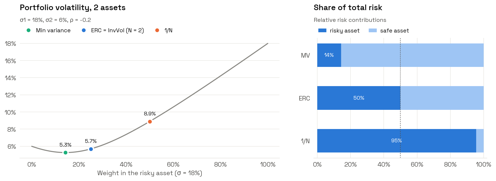

Deux actifs : un risqué ($\sigma = 18\%$) et un sûr ($\sigma = 6\%$), $\rho = -0.2$. Le min-variance (5.3 %) met 14 % du risque sur l'actif risqué, 1/N (8.9 %) en met 95 %, ERC (5.7 %) exactement 50 %. La volatilité d'ERC est à peine au-dessus du minimum : **on achète beaucoup de diversification pour très peu de variance**.

**Pourquoi ERC fonctionne out-of-sample.**
- N'utilise pas $\mu$ (la quantité la plus mal estimée).
- N'inverse pas $\Sigma$ : les poids dépendent continûment et de manière stable de $\Sigma$, alors que le min-variance amplifie le bruit des petites valeurs propres.
- Si les Sharpe ratios de tous les actifs sont égaux **et** les corrélations homogènes, ERC est le portefeuille tangent (max-Sharpe). ERC est donc optimal sous une hypothèse "d'ignorance" raisonnable.

**Tips.**
- ERC surpondère les actifs peu volatils (obligations). Sa performance historique doit beaucoup au marché haussier obligataire 1981-2020. En 2022, actions et obligations ont baissé ensemble (corrélation positive) : les fonds risk parity levérés ont perdu 20 à 30 %.
- Un ERC non levéré a une faible volatilité (8 % dans l'exemple). La comparaison avec 1/N doit se faire en **Sharpe**, ou à volatilité égale.

> **Dans le code** : `ERC(cov_method=...)`.

### 4.5 Hierarchical Risk Parity (HRP)

**Intuition** (López de Prado 2016). Markowitz traite tous les actifs comme des substituts potentiels les uns des autres (graphe complet). Or les actifs ont une **structure hiérarchique** : SPY et IWM sont proches, TLT et IEF aussi, et ces deux familles sont éloignées. HRP alloue d'abord **entre familles**, puis **à l'intérieur**.

**Étape 1 : distance.** 

$$d_{ij} = \sqrt{\tfrac12 (1 - \rho_{ij})} \in [0, 1]$$

C'est une vraie métrique : si $z_i$ est la série de l'actif $i$ centrée et normalisée à norme 1, alors $\rho_{ij} = z_i^\top z_j$ et $\lVert z_i - z_j \rVert^2 = 2(1 - \rho_{ij})$, donc $d_{ij} = \frac{1}{2}\lVert z_i - z_j \rVert_2$. L'inégalité triangulaire est héritée de la norme euclidienne. $\rho = 1 \Rightarrow d = 0$, $\rho = -1 \Rightarrow d = 1$.

**Étape 2 : clustering hiérarchique.** Agglomération successive des deux clusters les plus proches. La distance entre clusters dépend du `linkage` :
- `single` : $\min$ des distances (papier original). Sensible à l'**effet de chaîne**.
- `complete` : $\max$. Clusters compacts.
- `average` : moyenne. Bon compromis.
- `ward` : minimise l'augmentation de variance intra-cluster.

**Étape 3 : quasi-diagonalisation.** On réordonne les actifs selon l'ordre des feuilles du dendrogramme. Les actifs corrélés deviennent voisins et la matrice de covariance réordonnée a ses grandes valeurs **près de la diagonale**.

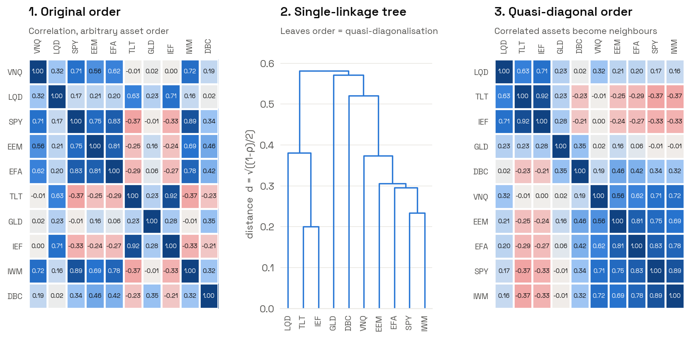

Dans l'ordre arbitraire (gauche), la structure est invisible. Après quasi-diagonalisation (droite), deux blocs apparaissent : taux et crédit (LQD, TLT, IEF) en haut, actifs risqués (VNQ, EEM, EFA, SPY, IWM) en bas, avec l'or et les matières premières entre les deux.

**Étape 4 : bissection récursive.** On part de $w = \mathbf{1}$. À chaque découpage d'un cluster en deux sous-clusters $L$ et $R$ :

$$V_c = \tilde w_c^\top \Sigma_c \tilde w_c, \qquad \tilde w_c = \frac{\operatorname{diag}(\Sigma_c)^{-1}}{\mathbf{1}^\top \operatorname{diag}(\Sigma_c)^{-1}}$$

$$\alpha = 1 - \frac{V_L}{V_L + V_R}, \qquad w_L \leftarrow \alpha\, w_L, \qquad w_R \leftarrow (1 - \alpha)\, w_R$$

$V_c$ est la variance du portefeuille inverse-variance du cluster $c$. Chaque sous-cluster reçoit une part **inversement proportionnelle à sa variance** : c'est une allocation inverse-variance entre deux "super-actifs".

**Propriétés.**
- **Aucune inversion de matrice** : seules les diagonales des sous-blocs sont inversées. Fonctionne même si $\Sigma$ est singulière ($T < N$).
- Avec $N = 2$, HRP = inverse variance.
- Si $\Sigma$ est diagonale, HRP = inverse variance (toutes les étapes reviennent à ça).

**Deux variantes de découpage** (`split=`) :
- `"bisection"` (papier original) : coupe la **liste ordonnée** en deux moitiés égales. Ne respecte pas l'arbre : un cluster naturel de 3 actifs dans un univers de 10 peut être coupé en deux.
- `"dendrogram"` : suit les vrais nœuds du dendrogramme. Plus fidèle à la structure. Recommandé.

**Tips.**
- Le code original de López de Prado passe la matrice **carrée** $d$ à `scipy.cluster.hierarchy.linkage`. SciPy interprète alors chaque ligne comme une observation et calcule $\tilde d_{ij} = \lVert d_{\cdot,i} - d_{\cdot,j} \rVert_2$, une "distance de distances". Beaucoup d'implémentations ont reproduit ce comportement sans le savoir. Ici on passe la forme condensée (`squareform`), donc $d$ elle-même.
- HRP est instable dans le temps : un petit changement de corrélation peut réorganiser l'arbre et déplacer beaucoup de poids. Dans l'exemple, son turnover (120 %/an) est **2.5 fois** celui d'ERC. Avec 20 bps de coûts, c'est 24 bps/an de performance perdue. Essayez `linkage="ward"` ou `"average"`.
- HRP a tendance à concentrer le risque dans le cluster le moins volatil (71 % du risque sur TLT, IEF et LQD dans l'exemple). C'est un portefeuille **défensif** plus qu'un portefeuille "diversifié en risque".

> **Dans le code** : `HRP(linkage="single", split="bisection")`. Attributs `order_` (ordre quasi-diagonal) et `linkage_matrix_` (pour tracer le dendrogramme avec `scipy.cluster.hierarchy.dendrogram`).

### 4.6 Tableau comparatif

| | 1/N | InvVol | Risk Budgeting / ERC | HRP |
|---|---|---|---|---|
| Utilise $\mu$ | non | non | non | non |
| Utilise $\sigma_i$ | non | oui | oui | oui |
| Utilise $\rho_{ij}$ | non | non | oui | oui (structure) |
| Inverse $\Sigma$ | non | non | non | non |
| Solution | directe | directe | itérative, unique | directe, dépend de l'arbre |
| Complexité | $O(N)$ | $O(N)$ | $O(N^2)$ par cycle | $O(N^2)$ (linkage) |
| Égalise | le capital | $w_i \sigma_i$ | $w_i (\Sigma w)_i$ | la variance entre clusters |
| Stabilité des poids | parfaite | très bonne | bonne | moyenne |
| Point faible | concentration du risque | ignore les corrélations | levier nécessaire pour la perf | turnover, sensibilité au linkage |

---

## 5. Le backtest walk-forward

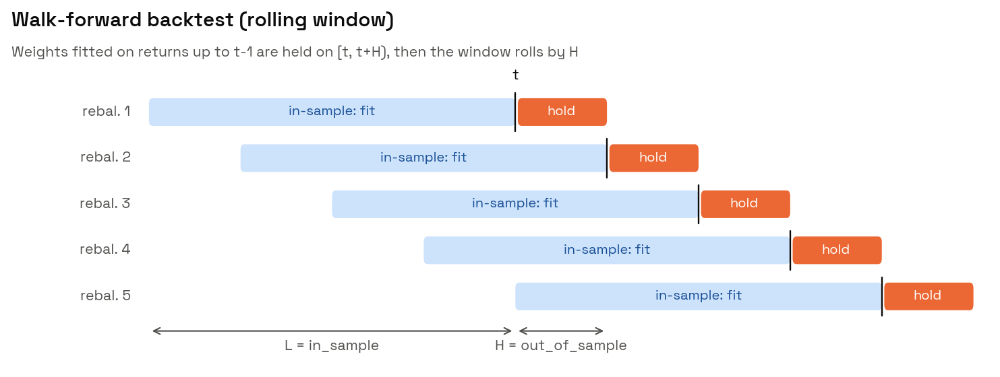

### Mécanique

À chaque date de rebalancement $t$ :

1. **Fenêtre in-sample** : $R_{t-L}, \dots, R_{t-1}$ (`window="rolling"`) ou $R_0, \dots, R_{t-1}$ (`"expanding"`).
2. **Univers** : les actifs sans aucun NaN sur la fenêtre.
3. **Estimation** : `estimator.fit(fenêtre)` (copie profonde de l'estimateur à chaque date, aucun état ne fuit).
4. **Détention** : les poids sont appliqués à $R_t, \dots, R_{t+H-1}$.
5. $t \leftarrow t + H$.

Les poids utilisent l'information jusqu'à $t-1$ et gagnent $R_t$ : **pas de look-ahead** (vérifié par un test avec un estimateur espion qui enregistre la dernière date vue).

### Dérive des poids (`drift=True`)

Entre deux rebalancements, un portefeuille réel ne garde pas des poids constants : ils **dérivent** avec les prix. Pour $k = 1, \dots, H$ :

$$V_k = \sum_i w_i \prod_{s=1}^{k} (1 + R_{i,s}), \qquad R_{p,k} = \frac{V_k}{V_{k-1}} - 1, \qquad w_i^{\text{drift}} = \frac{w_i \prod_{s=1}^{H}(1 + R_{i,s})}{V_H}$$

Implémentation vectorisée : `np.cumprod(1 + R, axis=0) @ w` donne tout le chemin $V_1, \dots, V_H$ d'un coup.

Avec `drift=False`, le portefeuille est supposé rebalancé **chaque jour** vers la cible, gratuitement. C'est plus optimiste que la réalité (on récolte le "rebalancing premium" sans en payer le coût).

### Coûts de transaction

Au rebalancement, le turnover one-way est mesuré contre les **poids dérivés** :

$$\tau_t = \sum_i \left| w_i^{\text{cible}} - w_i^{\text{drift}} \right|$$

Erreur fréquente : mesurer contre la cible précédente. Si les actions ont monté de 10 % pendant le mois, un portefeuille ERC doit en vendre même si sa cible n'a pas bougé. Ignorer la dérive **sous-estime** le turnover.

La richesse est multipliée par $(1 - c\,\tau_t)$ au rebalancement, avec $c$ en bps (`transaction_cost_bps`). Le premier rebalancement part du cash ($\tau = 1$).

Turnover annualisé (hors construction initiale) :

$$\text{Turnover}_{\text{ann}} = \frac{\sum_{t > t_0} \tau_t}{\text{nombre d'années}}$$

Coût annuel $\approx c \times \text{Turnover}_{\text{ann}}$. Exemple : 120 % de turnover à 10 bps = 12 bps/an.

### Tips

- **$(L, H)$ est un hyperparamètre.** Testez une grille et regardez la **stabilité du classement** des méthodes, jamais le meilleur couple (sinon vous sur-ajustez le backtest).
- **Timing luck.** Décaler la première date de rebalancement de 0 à $H-1$ jours donne $H$ trajectoires différentes pour la même stratégie. L'écart entre elles mesure la part de hasard du résultat. Pour une stratégie mensuelle, cet écart est souvent du même ordre que les différences entre méthodes.
- `window="expanding"` réduit le bruit d'estimation mais réagit lentement aux régimes. `rolling` avec $L = 252$ à $756$ est le standard.

> **Dans le code** : `Backtester(returns, estimator, in_sample, out_of_sample, window, transaction_cost_bps, drift)`. `.run()` renvoie les rendements OOS nets. Attributs `weights_`, `turnover_`, `gross_returns_`, méthodes `annualized_turnover()` et `risk_contributions()`. `run_backtests(returns, {name: est}, ...)` pour comparer.

---

## 6. Indicateurs de performance

Toutes les métriques prennent une `pd.Series` (une stratégie) ou un `pd.DataFrame` (une colonne par stratégie) de rendements simples périodiques. $\bar R$ et $\hat\sigma$ désignent la moyenne et l'écart-type empiriques (ddof = 1). `summary()` produit le tableau complet.

> **Dans le code** : `portopt/metric.py`.

### 6.1 Rendement total et CAGR

$$\text{TR} = \prod_{t=1}^{T} (1 + R_t) - 1, \qquad \text{CAGR} = (1 + \text{TR})^{P/T} - 1$$

Le CAGR est le taux constant qui donne la même richesse finale. C'est le rendement **effectivement vécu** par l'investisseur.

### 6.2 Moyenne arithmétique annualisée

$$\mu_{\text{ann}} = P \cdot \bar R$$

### 6.3 Volatility drag

**Résultat.** $\text{CAGR} \approx \mu_{\text{ann}} - \frac{\sigma_{\text{ann}}^2}{2}$

*Démonstration.* $\ln(1 + \text{CAGR}) = \frac{P}{T}\sum_t \ln(1 + R_t)$. Avec $\ln(1 + R) \approx R - R^2/2$ et $\frac1T \sum R_t^2 \approx \sigma^2 + \bar R^2 \approx \sigma^2$ en daily, on obtient $\ln(1 + \text{CAGR}) \approx P\bar R - P\sigma^2/2 = \mu_{\text{ann}} - \sigma_{\text{ann}}^2/2$. $\blacksquare$

**Exemple.** Deux stratégies à $\mu = 8\%$ : l'une à $\sigma = 10\%$ compose à $\approx 7.5\%$, l'autre à $\sigma = 30\%$ à $\approx 3.5\%$. Dans l'exemple, 1/N a $\mu = 7.36\%$ et $\sigma = 11.42\%$ : la formule prédit un taux de croissance log de $7.36\% - 0.65\% = 6.71\%$, le réalisé est $\ln(1.0693) = 6.70\%$.

**Tip.** C'est l'argument le plus solide en faveur de la réduction de variance : à moyenne égale, moins de volatilité = plus de richesse finale. Le "rebalancing premium" (Fernholz, Booth & Fama) en est la version multi-actifs : $\text{CAGR}_p - \sum_i w_i \text{CAGR}_i \approx \frac12\left(\sum_i w_i \sigma_i^2 - \sigma_p^2\right) \ge 0$.

### 6.4 Sharpe ratio

$$\text{SR} = \sqrt{P}\ \frac{\overline{R - r_f}}{\hat\sigma}, \qquad r_{f,\text{période}} = (1 + r_{f,\text{ann}})^{1/P} - 1$$

Rendement excédentaire par unité de risque total. **Invariant au levier** : levérer ×2 double l'excès de rendement et la volatilité. Un investisseur mean-variance choisit toujours la stratégie de plus haut Sharpe puis ajuste le levier.

**Annualisation par $\sqrt{P}$** : valide seulement si les rendements sont iid. Avec une autocorrélation d'ordre 1 $\rho_1$ (Lo 2002),

$$\text{SR}_{\text{ann}} \approx \text{SR}_{\text{période}} \cdot \sqrt{P} \cdot \sqrt{\frac{1 - \rho_1}{1 + \rho_1}} \quad \text{(approx. pour } \rho_1 \text{ constant)}$$

Des rendements lissés ($\rho_1 > 0$, hedge funds illiquides, private equity) ont un Sharpe $\sqrt{P}$ **surestimé**.

### 6.5 Sortino ratio

$$\text{Sortino} = \sqrt{P}\ \frac{\overline{R - \tau}}{DD_\tau}, \qquad DD_\tau = \sqrt{\frac{1}{T}\sum_{t=1}^{T} \min(R_t - \tau, 0)^2}$$

Ne pénalise que la volatilité **à la baisse**. Attention au dénominateur : la somme porte sur **toutes** les observations (les positives comptent pour 0), pas seulement les négatives. Diviser par le nombre d'observations négatives est une erreur courante qui gonfle le downside deviation.

Pour une distribution symétrique, $\text{Sortino} \approx \sqrt2 \cdot \text{Sharpe}$. Un ratio Sortino/Sharpe nettement supérieur à 1.41 signale une asymétrie positive.

### 6.6 Calmar ratio

$$\text{Calmar} = \frac{\text{CAGR}}{|\text{MaxDD}|}$$

Nombre d'années de rendement nécessaires pour compenser la pire perte. Très dépendant de la longueur de l'historique (le MaxDD ne peut qu'empirer avec $T$) : ne comparer que des stratégies sur **la même période**.

### 6.7 Hit ratio

$$\text{Hit} = \frac{1}{T}\sum_t \mathbb{1}\{R_t > 0\}$$

Proche de 50-55 % pour les stratégies d'allocation en daily. Peu informatif seul : un hit ratio de 40 % avec des gains 2× plus grands que les pertes est excellent (typique du trend following), un hit ratio de 90 % peut cacher une vente de volatilité (petits gains fréquents, pertes rares et énormes).

---

## 7. Indicateurs de risque

### 7.1 Volatilité annualisée

$$\sigma_{\text{ann}} = \hat\sigma \sqrt{P}$$

Mesure symétrique : une hausse de 5 % "coûte" autant qu'une baisse de 5 %. Insuffisante pour des distributions asymétriques ou à queues épaisses (§7.4).

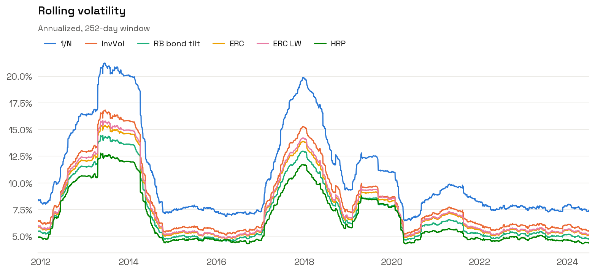

La volatilité réalisée n'est pas constante : elle se regroupe par régimes (**volatility clustering**). Ici les trois épisodes de stress simulés font doubler la vol de toutes les stratégies. L'**écart** entre stratégies reste stable : 1/N est toujours la plus volatile, HRP la moins.

### 7.2 Drawdown

$$W_t = \prod_{s \le t} (1 + R_s), \qquad DD_t = \frac{W_t}{\max\left(1, \max_{s \le t} W_s\right)} - 1, \qquad \text{MaxDD} = \min_t DD_t$$

Le capital initial compte comme un pic : une stratégie qui perd 10 % le premier jour a un drawdown de −10 %, même si $W$ n'a jamais été au-dessus de 0.9.

**Durée maximale sous l'eau** : plus longue période consécutive avec $DD_t < 0$, du pic jusqu'au retour au pic (ou jusqu'à la fin de l'échantillon si pas de récupération).

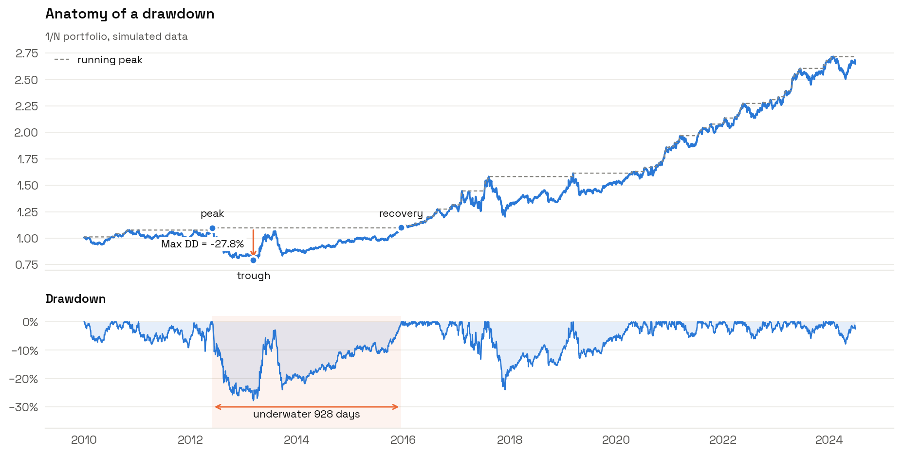

**Asymétrie des pertes.** Pour récupérer une perte $L$, il faut un gain $L / (1 - L)$ : −20 % demande +25 %, −50 % demande +100 %.

**Tip.** Sous hypothèse de mouvement brownien avec drift $\mu$ et volatilité $\sigma$, le MaxDD espéré croît comme $\sigma\sqrt{T}$ pour $\mu = 0$ et comme $\frac{\sigma^2}{\mu}\ln(\cdot)$ pour $\mu > 0$ (Magdon-Ismail et al. 2004). Le MaxDD dépend donc mécaniquement de la durée du backtest : un MaxDD de −15 % sur 5 ans n'est pas comparable à −15 % sur 20 ans.

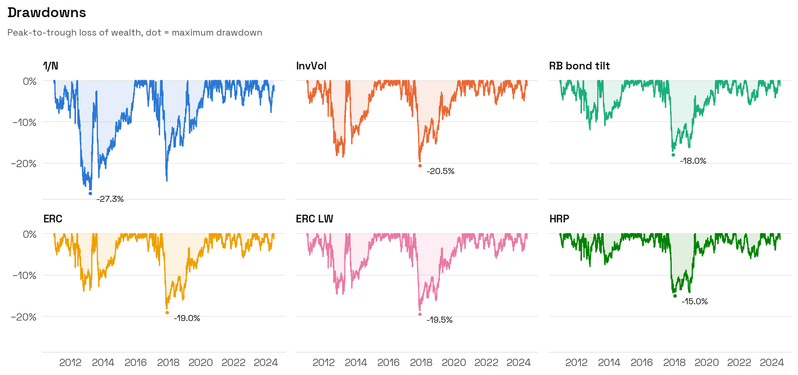

### 7.3 VaR et CVaR historiques

$$\text{VaR}_\alpha = -q_\alpha(R), \qquad \text{CVaR}_\alpha = -\mathbb{E}\left[R \mid R \le q_\alpha(R)\right]$$

avec $q_\alpha$ le quantile empirique d'ordre $\alpha$ (5 % par défaut). Les deux sont exprimées en **perte positive**.

- **VaR 95 %** : "95 % des jours, on ne perd pas plus que ça". Ne dit rien de ce qui se passe les 5 % restants.
- **CVaR 95 %** (Expected Shortfall) : "les 5 % des pires jours, on perd en moyenne ça".

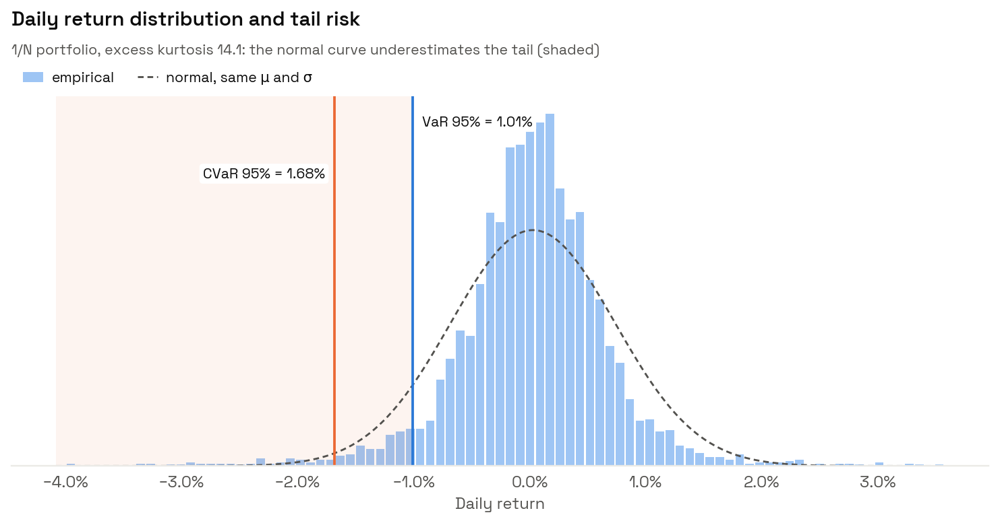

**Pourquoi la CVaR est meilleure.** La VaR n'est **pas sous-additive** : on peut avoir $\text{VaR}(A + B) > \text{VaR}(A) + \text{VaR}(B)$, ce qui signifie que la VaR peut pénaliser la diversification. Contre-exemple classique : deux obligations indépendantes, chacune avec 4 % de probabilité de défaut (perte 100) et sinon rien. $\text{VaR}_{95\%}$ de chacune = 0 (le défaut est au-delà du quantile 5 %). Le portefeuille des deux a une probabilité $1 - 0.96^2 = 7.84\% > 5\%$ qu'au moins une fasse défaut : $\text{VaR}_{95\%} > 0 = 0 + 0$. La CVaR est une **mesure de risque cohérente** (Artzner et al. 1999) : monotone, invariante par translation, positivement homogène et sous-additive. Bâle III a remplacé la VaR 99 % par l'ES 97.5 % pour le risque de marché.

**Tip.** La VaR paramétrique gaussienne $\text{VaR}_\alpha = -(\mu + z_\alpha \sigma)$ sous-estime systématiquement le risque de queue. Si vous devez rester paramétrique, utilisez l'expansion de Cornish-Fisher qui corrige le quantile par la skewness et la kurtosis.

### 7.4 Skewness et kurtosis

$$\gamma_3 = \frac{\mathbb{E}[(R - \mu)^3]}{\sigma^3}, \qquad \gamma_4 = \frac{\mathbb{E}[(R - \mu)^4]}{\sigma^4}, \qquad \text{kurtosis excédentaire} = \gamma_4 - 3$$

- $\gamma_3 < 0$ : queue gauche épaisse, pertes rares mais grandes. Typique des stratégies de portage, de vente d'options, du crédit.
- $\gamma_4 - 3 > 0$ (leptokurtique) : plus de jours "calmes" et plus de jours extrêmes qu'une gaussienne. En daily, 5 à 20 est courant pour les indices actions.

**Tip.** Ces moments d'ordre élevé sont très mal estimés : un seul jour extrême peut faire basculer la skewness de −1 à +1. Regardez-les sur des sous-périodes avant d'en tirer une conclusion.

### 7.5 Turnover

Défini au §5. C'est un **indicateur de risque d'implémentation** : un turnover élevé expose aux coûts, à l'impact de marché et à la capacité limitée de la stratégie.

---

## 8. Significativité statistique

Un backtest est **une** réalisation d'un processus aléatoire. Avant de conclure qu'une stratégie en bat une autre, il faut se demander si la différence est distinguable du bruit.

### 8.1 Erreur standard du Sharpe

Pour des rendements iid gaussiens (Lo 2002), en unités annuelles avec $Y$ années :

$$\operatorname{se}(\widehat{\text{SR}}) \approx \sqrt{\frac{1 + \frac12 \text{SR}_{\text{période}}^2}{Y}} \approx \frac{1}{\sqrt{Y}}$$

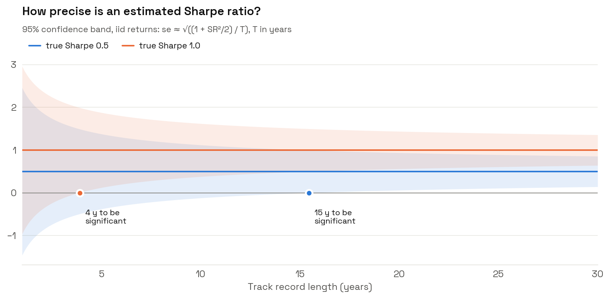

Pour qu'un Sharpe de 0.5 soit significativement positif à 95 %, il faut environ **15 ans** de données. Pour un Sharpe de 1, environ **4 ans**. La plupart des backtests de 10 ans ne permettent pas de distinguer un Sharpe de 0.5 d'un Sharpe de 0.

**Conséquence pour l'exemple** : les Sharpes vont de 0.64 (1/N) à 0.88 (HRP) sur 14 ans. L'erreur standard est $\approx 0.27$. La différence 0.24 est **inférieure à une erreur standard** : on ne peut pas affirmer que HRP bat 1/N. (La différence de Sharpe entre deux stratégies corrélées a une erreur standard plus faible, test de Jobson-Korkie / Memmel, mais reste du même ordre.)

### 8.2 Probabilistic Sharpe Ratio (Bailey & López de Prado 2012)

Correction de l'erreur standard pour la non-normalité :

$$\text{PSR}(\text{SR}^{\ast}) = \Phi\left(\frac{(\widehat{\text{SR}} - \text{SR}^{\ast})\sqrt{T - 1}}{\sqrt{1 - \gamma_3\, \widehat{\text{SR}} + \frac{\gamma_4 - 1}{4}\, \widehat{\text{SR}}^2}}\right)$$

où $\widehat{\text{SR}}$ et $\text{SR}^{\ast}$ sont **non annualisés** (par période), $\gamma_3$ la skewness, $\gamma_4$ la kurtosis (non excédentaire). C'est la probabilité que le vrai Sharpe dépasse le seuil $\text{SR}^{\ast}$.

**Lecture du dénominateur.** Skewness négative ou kurtosis élevée **augmentent** la variance de $\widehat{\text{SR}}$, donc **baissent** le PSR. Une stratégie de vente de volatilité avec un beau Sharpe mais $\gamma_3 = -3$ aura un PSR bien plus faible qu'une stratégie trend following de même Sharpe avec $\gamma_3 > 0$.

`summary()` affiche PSR(SR > 0). Au-dessus de 0.95 : Sharpe significativement positif.

### 8.3 Deflated Sharpe Ratio (Bailey & López de Prado 2014)

Si vous avez testé $K$ variantes (paramètres, univers, méthodes) et gardé la meilleure, son Sharpe est biaisé à la hausse : même si tous les vrais Sharpes sont nuls, le maximum de $K$ Sharpes estimés est positif. Le DSR remplace $\text{SR}^{\ast}$ dans le PSR par le maximum attendu de $K$ Sharpes nuls :

$$\text{SR}^{\ast}_K \approx \sqrt{\operatorname{Var}(\widehat{\text{SR}}_k)}\left[(1 - \gamma_E)\, \Phi^{-1}\!\left(1 - \frac{1}{K}\right) + \gamma_E\, \Phi^{-1}\!\left(1 - \frac{1}{K e}\right)\right]$$

avec $\gamma_E \approx 0.5772$ (constante d'Euler-Mascheroni) et $\operatorname{Var}(\widehat{\text{SR}}_k)$ la variance des Sharpes observés sur les $K$ essais. Avec $K = 100$ essais, il faut un Sharpe observé d'environ $2.5 \times \operatorname{se}$ pour ne pas être du pur data mining.

**Règle d'hygiène** : notez le nombre de variantes que vous avez testées. C'est une donnée du backtest aussi importante que le Sharpe.

---

## 9. Lecture des résultats de l'exemple

`python examples/run_backtest.py --synthetic` : 10 ETF simulés, fenêtre 252 jours, rebalancement tous les 21 jours, 5 bps de coûts, décembre 2010 à juin 2024 (3 528 jours OOS).


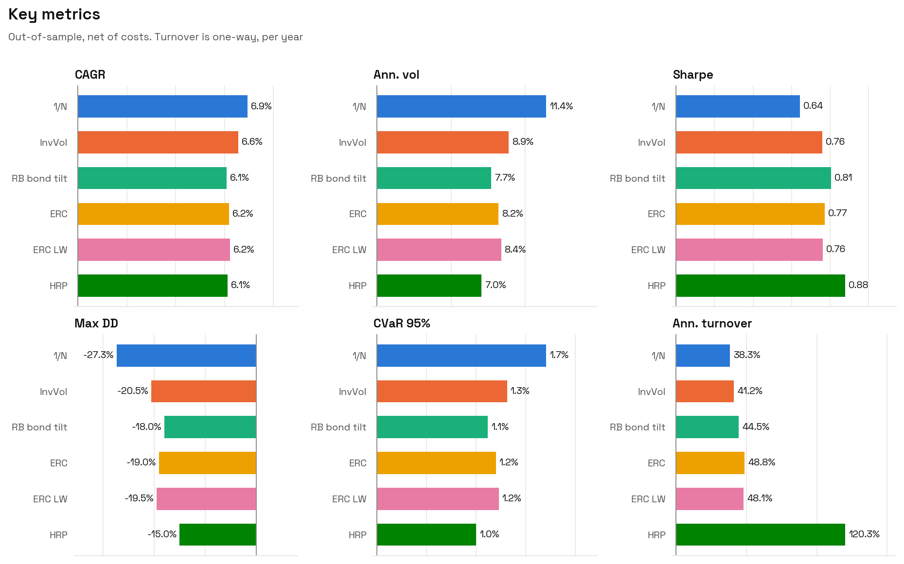

| | 1/N | InvVol | RB bond tilt | ERC | ERC LW | HRP |
|---|---|---|---|---|---|---|
| CAGR | 6.9 % | 6.6 % | 6.1 % | 6.2 % | 6.2 % | 6.1 % |
| Volatilité | 11.4 % | 8.9 % | 7.7 % | 8.2 % | 8.4 % | 7.0 % |
| Sharpe | 0.64 | 0.76 | 0.81 | 0.77 | 0.76 | 0.88 |
| Max DD | −27.3 % | −20.5 % | −18.0 % | −19.0 % | −19.5 % | −15.0 % |
| CVaR 95 % (jour) | 1.7 % | 1.3 % | 1.1 % | 1.2 % | 1.2 % | 1.0 % |
| Turnover / an | 38 % | 41 % | 45 % | 49 % | 48 % | 120 % |

**Ce qu'il faut en retenir.**

1. **1/N a le meilleur CAGR mais le pire risque.** Il est simplement plus exposé aux actifs risqués qui ont le meilleur rendement sur la période. Son Sharpe est le plus faible.
2. **Toutes les méthodes risk-based améliorent le Sharpe et réduisent le drawdown** de 25 à 45 %. C'est le résultat robuste de la littérature.
3. **L'ordre ERC / InvVol / HRP n'est pas significatif** (§8.1). Ne pas conclure "HRP est la meilleure méthode" sur ce backtest.
4. **ERC LW ≈ ERC** : avec 10 actifs et 252 jours ($q = 0.04$), le shrinkage est faible ($\delta$ médian de 4 %, 15 % au maximum). Il devient décisif avec 50+ actifs.
5. **Le coût caché de HRP est son turnover**, 2.5× celui d'ERC.

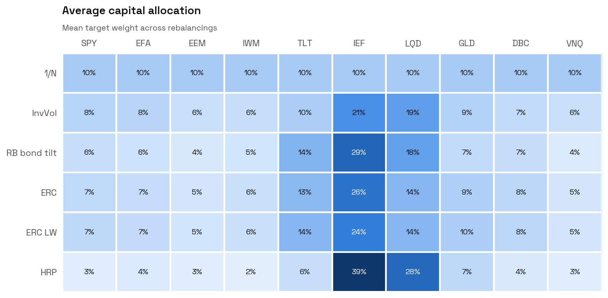

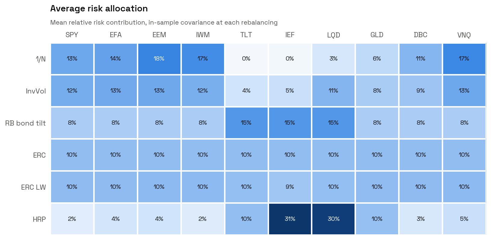

Ces deux tableaux résument la différence entre les méthodes mieux que n'importe quelle métrique :

- **1/N** : capital égal (10 % partout), mais **79 % du risque** sur les actifs actions-like (SPY, EFA, EEM, IWM, VNQ). Les Treasuries contribuent à 0 % (voire négativement) grâce à leur corrélation négative.
- **ERC** : risque exactement égal (10 % partout), au prix de 40 % du capital en IEF+TLT.
- **RB bond tilt** : les budgets 2× sur TLT, IEF, LQD sont respectés (15 % chacun).
- **HRP** : 73 % du capital et 71 % du risque sur les trois ETF obligataires, dont 67 % du capital sur IEF et LQD seuls. La bissection a traité le bloc taux comme "l'autre moitié" de l'univers et lui a donné un poids massif en tant que cluster peu volatil.

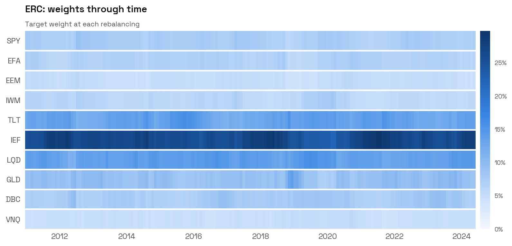

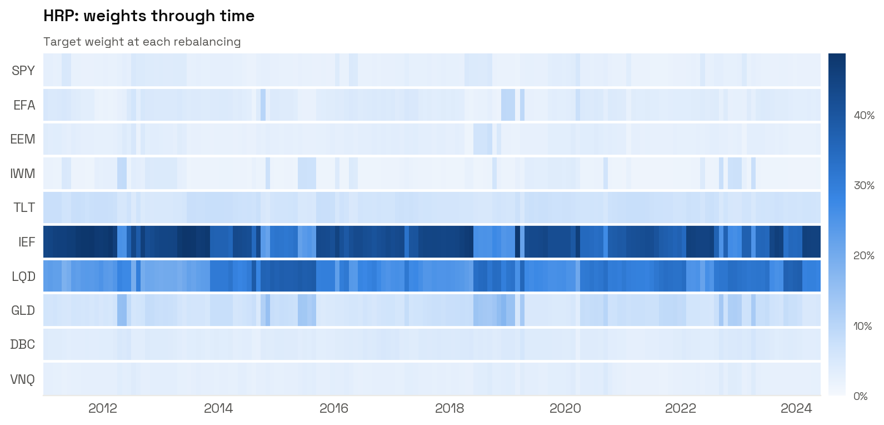

ERC ajuste ses poids de façon continue et lisse. HRP saute d'une configuration à l'autre quand l'arbre de clustering change : c'est l'origine visible de son turnover.

---

## 10. Checklist de l'expert

**Données**
- [ ] Prix ajustés (total return), jamais de rendements sur prix bruts.
- [ ] Pas de `bfill`, pas de suppression des actifs à historique court (biais de survie).
- [ ] Rendements simples pour le portefeuille.

**Estimation**
- [ ] Ratio $N/T$ vérifié. Au-delà de 0.1, shrinkage ou modèle factoriel.
- [ ] $\mu$ jamais utilisé sans prior fort ou shrinkage massif.

**Backtest**
- [ ] Poids calculés avec l'information jusqu'à $t-1$ uniquement.
- [ ] Dérive des poids modélisée, turnover mesuré contre les poids dérivés.
- [ ] Coûts de transaction réalistes (5 à 20 bps sur ETF liquides, plus sur small caps et EM).
- [ ] Robustesse testée sur une grille $(L, H)$ et sur les offsets de rebalancement.
- [ ] Benchmark 1/N systématiquement inclus.

**Évaluation**
- [ ] Comparaison en Sharpe, ou à volatilité égale (levier), pas en CAGR brut.
- [ ] Erreur standard du Sharpe calculée avant toute conclusion.
- [ ] PSR pour la non-normalité, DSR si plusieurs variantes testées.
- [ ] Drawdowns et CVaR regardés, pas seulement la volatilité.
- [ ] Contributions au risque inspectées : savoir **où** est le risque.
- [ ] Sous-périodes et régimes analysés (la performance d'ensemble peut venir d'un seul épisode).

---

## 11. Références

**Allocation**
- DeMiguel, V., Garlappi, L., Uppal, R. (2009). *Optimal Versus Naive Diversification: How Inefficient Is the 1/N Portfolio Strategy?* Review of Financial Studies 22(5).
- Maillard, S., Roncalli, T., Teiletche, J. (2010). *The Properties of Equally Weighted Risk Contribution Portfolios.* Journal of Portfolio Management 36(4).
- Roncalli, T. (2013). *Introduction to Risk Parity and Budgeting.* Chapman & Hall/CRC.
- Spinu, F. (2013). *An Algorithm for Computing Risk Parity Weights.* SSRN.
- Griveau-Billion, T., Richard, J.-C., Roncalli, T. (2013). *A Fast Algorithm for Computing High-dimensional Risk Parity Portfolios.* SSRN.
- López de Prado, M. (2016). *Building Diversified Portfolios that Outperform Out of Sample.* Journal of Portfolio Management 42(4).
- Michaud, R. (1989). *The Markowitz Optimization Enigma: Is Optimized Optimal?* Financial Analysts Journal 45(1).

**Covariance**
- Ledoit, O., Wolf, M. (2004). *A Well-Conditioned Estimator for Large-Dimensional Covariance Matrices.* Journal of Multivariate Analysis 88(2).
- Ledoit, O., Wolf, M. (2020). *Analytical Nonlinear Shrinkage of Large-Dimensional Covariance Matrices.* Annals of Statistics 48(5).
- Marchenko, V., Pastur, L. (1967). *Distribution of Eigenvalues for Some Sets of Random Matrices.* Mathematics of the USSR-Sbornik 1(4).

**Mesure de performance et de risque**
- Artzner, P., Delbaen, F., Eber, J.-M., Heath, D. (1999). *Coherent Measures of Risk.* Mathematical Finance 9(3).
- Lo, A. (2002). *The Statistics of Sharpe Ratios.* Financial Analysts Journal 58(4).
- Bailey, D., López de Prado, M. (2012). *The Sharpe Ratio Efficient Frontier.* Journal of Risk 15(2).
- Bailey, D., López de Prado, M. (2014). *The Deflated Sharpe Ratio: Correcting for Selection Bias, Backtest Overfitting and Non-Normality.* Journal of Portfolio Management 40(5).
- Magdon-Ismail, M., Atiya, A., Pratap, A., Abu-Mostafa, Y. (2004). *On the Maximum Drawdown of a Brownian Motion.* Journal of Applied Probability 41(1).
